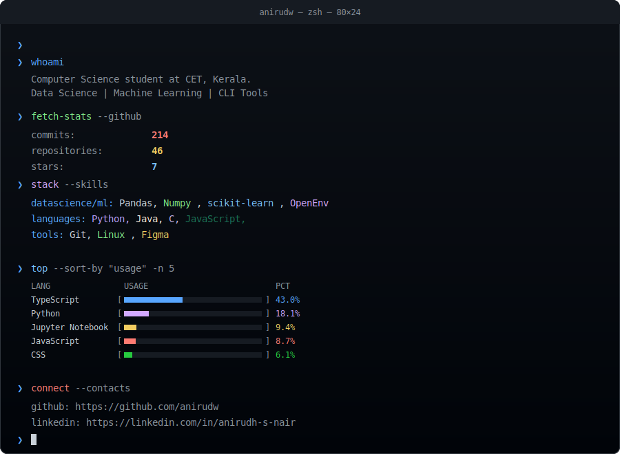

# Hello, World! 👋

<picture>
  <source media="(prefers-color-scheme: light)" srcset="templates/cli_dark.svg">
  
</picture>

---

### 🔧 Technologies & Tools

---

### 📫 Connect with Me

---

*Profile auto-updated daily*
