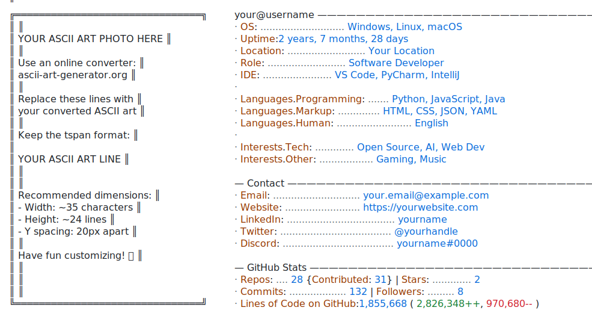

# GitHub Statistics Display

[](https://github.com/YOUR_USERNAME/YOUR_REPO/actions/workflows/update-stats.yml)

Automatically updated GitHub statistics display inspired by [Andrew6rant](https://github.com/Andrew6rant/Andrew6rant).

<picture>
  <source media="(prefers-color-scheme: dark)" srcset="dark_mode.svg">
  <source media="(prefers-color-scheme: light)" srcset="light_mode.svg">
  
</picture>

## Features

- 📊 **Real-time Statistics**: Commits, stars, repos, followers
- 📈 **Lines of Code**: Tracks additions, deletions, and net LOC
- ⚡ **Smart Caching**: Avoids redundant API calls
- 🎨 **Theme Support**: Light and dark mode SVGs
- 🤖 **Automated Updates**: GitHub Actions workflow runs every 6 hours

## How It Works

1. **Python Script** (`today.py`): Fetches data from GitHub's GraphQL API
2. **Caching System**: Stores LOC data in `cache/` to avoid recalculations
3. **SVG Update**: Uses lxml to update text elements in SVG files
4. **GitHub Actions**: Automatically runs the script and commits changes

## Setup

### 1. Create a Personal Access Token

Go to [GitHub Settings > Developer settings > Personal access tokens > Fine-grained tokens](https://github.com/settings/tokens?type=beta)

**Permissions needed:**
- **Account permissions**: `read:Followers`, `read:Starring`
- **Repository permissions**: `read:Contents`, `read:Metadata`

### 2. Add Token as Repository Secret

1. Go to your repository's **Settings > Secrets and variables > Actions**
2. Create a new secret named `PERSONAL_ACCESS_TOKEN`
3. Paste your token

### 3. Configure the Script

Edit `today.py` and update:

```python
# Set your birthdate for age calculation
BIRTHDATE = datetime(2002, 7, 5)  # Change to your birthdate
```

### 4. Run Locally (Optional)

```bash
# Install dependencies
pip install requests python-dateutil lxml

# Set environment variables
set GITHUB_USERNAME=your_username
set GITHUB_TOKEN=your_personal_access_token

# Run the script
python today.py
```

## Files

- `today.py` - Main Python script for fetching and updating statistics
- `dark_mode.svg` - Dark theme statistics display
- `light_mode.svg` - Light theme statistics display
- `cache/` - Directory for LOC caching (auto-generated)
- `.github/workflows/update-stats.yml` - GitHub Actions workflow

## Credit

Inspired by [Andrew6rant's GitHub profile](https://github.com/Andrew6rant/Andrew6rant)

## License

MIT License - Feel free to use and modify!
